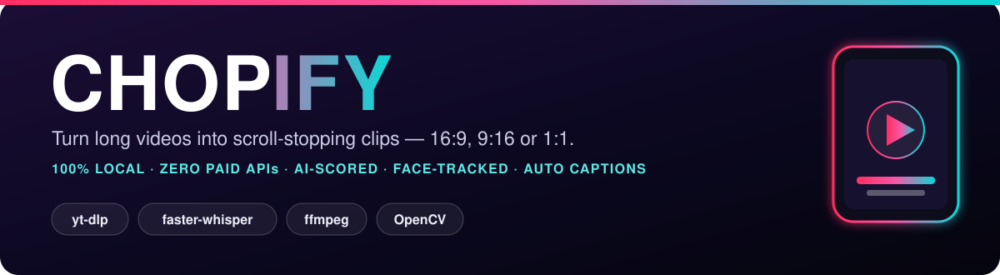
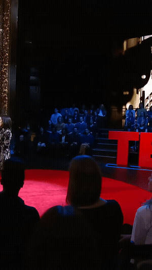
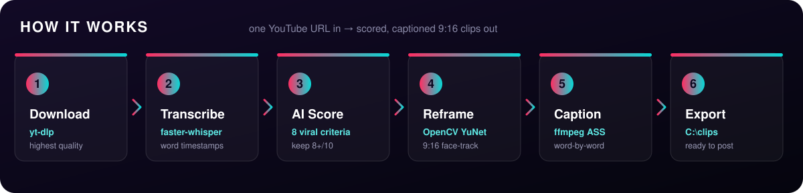

<p align="center">
  
</p>

<p align="center">
  
  
  
  
  
  
</p>

<p align="center"><b>Drop in a YouTube link &#8594; get back scored, captioned clips (16:9 or 9:16) &#8212; 100% on your own machine.</b></p>

---

**Chopify is a free, open-source, fully local alternative to Opus Clip, Vizard, Klap, 2Short and Submagic.** It automatically turns long videos &#8212; YouTube videos, podcasts, interviews and webinars &#8212; into short, ready-to-post viral clips in **16:9, 9:16 (vertical) or 1:1**, with AI virality scoring, automatic face-tracking reframe, and burnt-in word-by-word captions. Everything runs **100% on your own machine**: no subscription, no cloud upload, and no API keys.

> [!TIP]
> **New in v1.2** &#8212; **one command does everything**: `python chopify.py "URL"`. Clip picking is now **built in** (deterministic heuristic, or a local Ollama model via `--llm`) &#8212; no external LLM agent needed. Plus: `--tighten` removes "um"s and dead air, `--style hormozi/mrbeast/podcast` caption presets, `--loudnorm` broadcast loudness, `.meta.json` ready-to-post metadata per clip, and the output folder is finally configurable (`--out`, default `./clips`).

## Demo

<p align="center"></p>

## How it works

<p align="center">
  
</p>

## Features

- **One command** &#8212; `python chopify.py "<link>"` runs the whole pipeline: download &#8594; transcribe &#8594; score &#8594; render.
- **Built-in AI virality scoring &#8212; no API keys** &#8212; every segment is rated on hook, shock, humour, controversy, insight, emotion, energy and complete-arc. A deterministic heuristic runs out of the box; add `--llm` to use a **local Ollama model** instead. Nothing is ever sent to the cloud.
- **Tighten cuts** (`--tighten`) &#8212; filler words ("um", "uh", "you know") and long silences are removed automatically, with captions re-timed to match.
- **Caption style presets** &#8212; `default`, `hormozi` (red highlight), `mrbeast` (green), `podcast` (clean) &#8212; word-by-word, burnt in with ffmpeg.
- **Ready-to-post metadata** &#8212; every clip ships with a `.meta.json` (title, description, hashtags) plus a PNG poster thumbnail.
- **Multi-format output** &#8212; 16:9 (default, full frame), 9:16 (speaker-tracking auto-reframe via OpenCV YuNet, snap-on-cut + edge guard), or 1:1.
- **Loudness normalization** (`--loudnorm`) &#8212; broadcast-standard -14 LUFS audio.
- **Zero paid APIs, zero cloud** &#8212; yt-dlp + faster-whisper + ffmpeg + OpenCV, all local.
- **Content decides the count** &#8212; a 1-hour video might yield 2 clips or 20.

## Chopify vs. the paid tools

Chopify does the core of what these subscription products do &#8212; **AI-scored clips, auto-reframe to 9:16, and burnt word-by-word captions** &#8212; except it runs **free, on your own machine, and fully open-source**.

| Product | Pricing | Runs | Open source |
| --- | --- | --- | --- |
| **Chopify** | **Free** | **Local (your PC)** | **MIT** |
| [Opus Clip](https://www.opus.pro) | Paid subscription | Cloud | No |
| [Vizard.ai](https://vizard.ai) | Paid subscription | Cloud | No |
| [Klap](https://klap.app) | Paid subscription | Cloud | No |
| [2Short.ai](https://2short.ai) | Freemium + paid | Cloud | No |
| [Munch](https://www.getmunch.com) | Paid subscription | Cloud | No |
| [Spikes Studio](https://spikes.studio) | Freemium + paid | Cloud | No |
| [Submagic](https://www.submagic.co) | Paid subscription | Cloud | No |
| [SendShort](https://sendshort.ai) | Paid subscription | Cloud | No |

<sub>Independent products and trademarks of their respective owners; pricing and features change over time. Comparison covers the long-video to short-clip workflow only.</sub>

## Requirements

- Windows, Python 3.11+
- `ffmpeg` + `ffprobe` on PATH &#8212; `winget install Gyan.FFmpeg`
- `deno` on PATH (yt-dlp JS-challenge solving) &#8212; `winget install DenoLand.Deno`

## Install

```bash
python -m venv .venv
.venv\Scripts\python -m pip install -r requirements.txt
```

## Usage

**One command &#8212; link in, clips out:**

```bash
python chopify.py "https://youtube.com/watch?v=VIDEO_ID"
python chopify.py "URL" --aspect 9:16 --style hormozi --tighten --loudnorm
python chopify.py "URL" --llm qwen2.5:7b          # local Ollama picks the clips
```

**Or run the stages individually:**

**1. Download + transcribe** &#8594; writes `work/transcript.json`:

```bash
python download_and_transcribe.py "<YOUTUBE_URL>"
```

**2. Score** &#8594; writes `work/segments.json`:

```bash
python score_clips.py work                        # built-in heuristic, zero deps
python score_clips.py work --llm qwen2.5:7b       # local Ollama (JSON mode)
python score_clips.py work --min-score 7 --max-clips 12
```

Each segment: `{"start": 134.2, "end": 187.6, "hook": "short title", "overall": 8.4}`.
The heuristic scorer rates windows on the eight criteria (hook, shock, humour,
controversy, insight, emotion, energy, complete-arc) and keeps clips at/above
6.5 by default. With `--llm`, a local Ollama model does the picking in strict
JSON mode and falls back to the heuristic automatically if Ollama is missing.
Prefer an LLM agent? The JSON format above is all it needs.

**3. Render** &#8594; cut + reframe + burnt captions + poster + `.meta.json`:

```bash
python render_clips.py work --aspect 9:16 --style default --tighten
```

Output lands in `./clips` by default &#8212; change with `--out DIR` or `$CHOPIFY_OUT`.

## FAQ

**Is there a free alternative to Opus Clip?**
Yes &#8212; Chopify is a free, open-source, self-hosted alternative to Opus Clip, Vizard and Klap. It runs entirely on your own computer, with no subscription and no API keys.

**Can I turn long videos into short clips without paying?**
Yes. Chopify downloads a video, transcribes it locally, AI-scores every segment for virality, and exports the best moments as ready-to-post clips &#8212; for free.

**Does it run locally, offline and privately?**
Yes. Download, transcription, scoring and rendering all happen on your machine. Nothing is uploaded to the cloud.

**What formats / aspect ratios does it export?**
16:9 (landscape, default), 9:16 (vertical for TikTok, Reels and YouTube Shorts) and 1:1 (square). Each clip also gets a PNG poster.

**Do I need an OpenAI, Gemini or other paid API key?**
No. Chopify uses only open-source tools: yt-dlp, faster-whisper, ffmpeg and OpenCV. Clip selection runs on a built-in heuristic scorer, or on a **local** Ollama model with `--llm` &#8212; never a cloud API.

**How does chopify decide which moments become clips?**
Every transcript window is rated 0&#8211;10 on hook, shock, humour, controversy, insight, emotion, energy and complete-arc. By default a deterministic heuristic does this instantly and offline; `--llm qwen2.5:7b` hands the job to a local Ollama model for context-aware selection.

**What is it good for?**
Repurposing podcasts, interviews, webinars, lectures and long YouTube videos into short-form clips for TikTok, Instagram Reels and YouTube Shorts.

## Notes

- **GPU:** faster-whisper (CTranslate2) is **CUDA / NVIDIA-only**; on AMD it runs on CPU
  (whisper.cpp + Vulkan was attempted for AMD but is unstable on RDNA3 &#8212; crashes or
  returns corrupted output).
- **Captions** use a built-in ffmpeg ASS renderer (the PyPI `pycaps` is an empty stub).
- **Output folder:** `./clips` by default &#8212; change with `--out DIR` or `$CHOPIFY_OUT`.
- **Ollama is optional.** The built-in heuristic needs no LLM at all; `--llm` simply
  upgrades clip selection if you have [Ollama](https://ollama.com) installed locally.

<sub>Personal / educational use &#8212; you are responsible for the rights to any video you process.</sub>